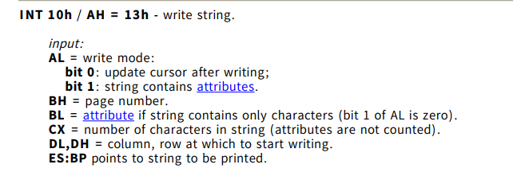
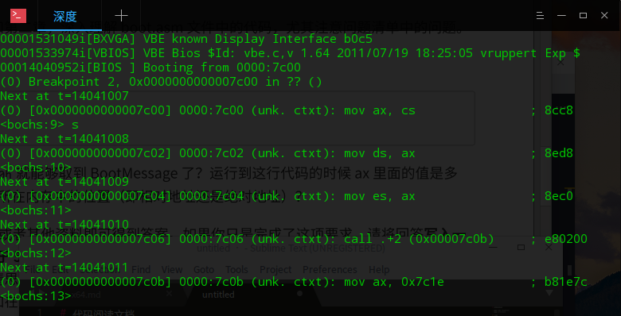
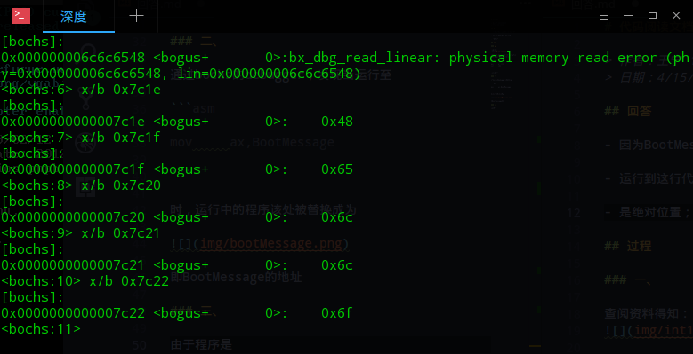

# 代码阅读文档

> 作者：王宁 161250139
> 日期：4/15/2018

## 回答

- 因为BootMessage的地址被送到bp中去了；

- 运行到这行代码的时候ax为`0x7c1e`；

- 对于宿主机而言是相对位置，对于程序本身而言是绝对位置;

## 过程

### 一、

查阅资料得知：


为了输出字符串，需要置AL、BX、CX、DL等寄存器，并且ES：BS指向字符串内存地址，然后使用

```asm

mov		al,13h
int 	10h

```

来调用该系统中断

### 二、

通过bochs的debugger，发现当运行至

```asm

mov		ax,BootMessage

```

时，运行中的程序该处被替换成为



即BootMessage的地址

### 三、

首先，程序运行在linux/bochs虚拟机中，所用内存是linux分配的虚拟内存，故不能称作绝对位置。

其次，debug模式下，使用`x/b`指令查看`0x7c1e`，发现依次有`H`、`e`、`l`、`l`、`o`的ascii码，也就是说程序就是存放在该地址中的。图如下：

